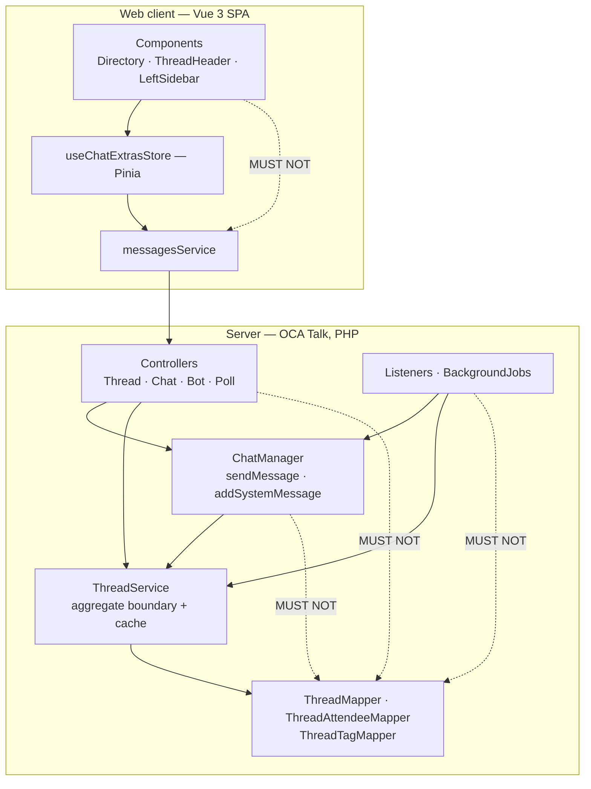
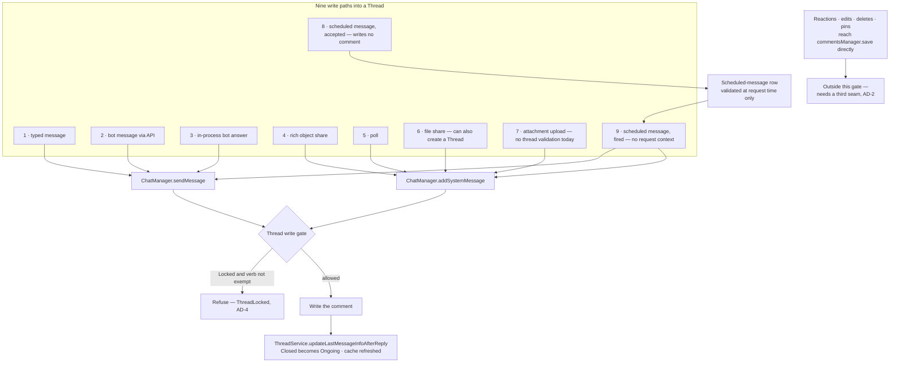
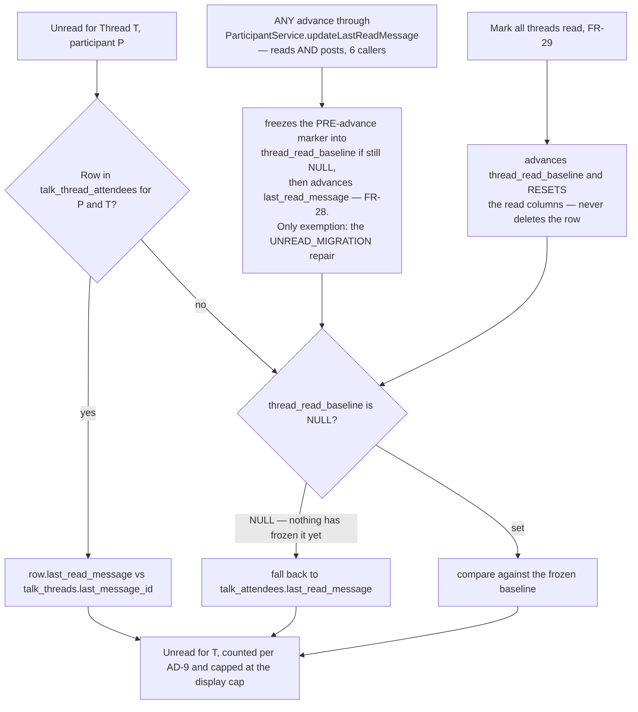
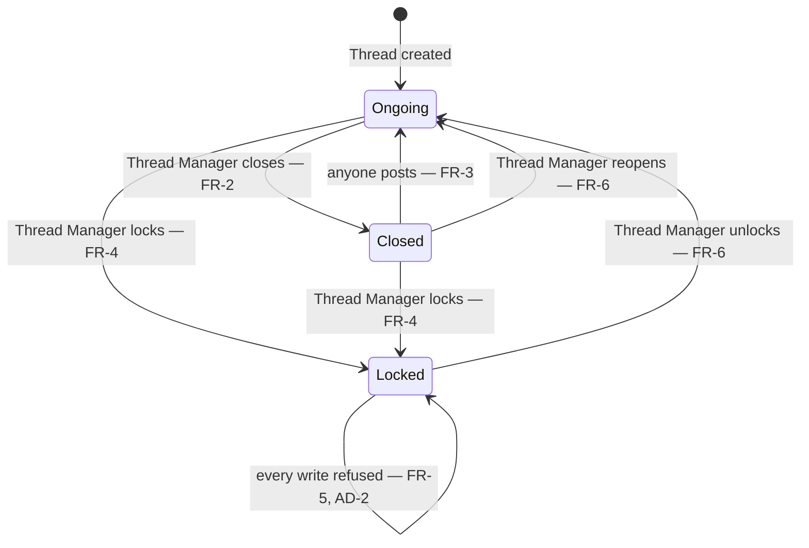
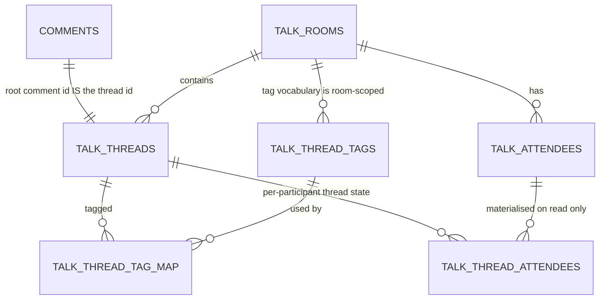

# Architecture Spine — Clavis Talk Thread Management and Navigation

## Design Paradigm

**Layered service-oriented, inside Nextcloud's app framework, with one aggregate boundary added for this feature.**

Upstream Talk already runs Controller → Service → Mapper/Entity, with `IEventDispatcher` listeners as the extension seam and background jobs as the out-of-band writer. This work does not introduce a new paradigm; it adds one constraint on top of the existing one, because Thread state is the first piece of Talk state that is written from five directions at once:

- `lib/Controller/` — request handling, authorisation, response shape. No persistence.
- `lib/Service/ThreadService.php` — **the aggregate boundary for every Thread**: state, featuring, tags, per-participant read markers, and the distributed cache that fronts them.
- `lib/Chat/ChatManager.php` — the choke point for messages *posted into* a Thread, and therefore where Thread write policy is enforced for them. It is **not** the only write path to the comments table: reactions, edits, deletes and pins reach `commentsManager->save()` by other routes (AD-2).
- `lib/Model/*Mapper.php` — persistence only, reachable from `ThreadService` alone.
- `lib/Listener/`, `lib/BackgroundJob/` — out-of-band writers, which reach persistence through the same two seams as everything else.

On the client, `src/stores/chatExtras.ts` (Pinia) owns Thread state; `src/services/messagesService.ts` is the transport it calls; components are read-and-dispatch only.

## Invariants & Rules

Allowed dependency direction. A dotted edge is a direction that MUST NOT exist.



### AD-1 — ThreadService is the sole write seam for Thread rows and the Thread cache

- **Binds:** all
- **Prevents:** each epic writing `talk_threads` through a mapper with its own — or missing — cache invalidation. Thread data is served from a distributed cache with a 900s TTL and negative caching, so a missed invalidation makes a state change succeed for the actor and revert for everyone else, and can make a newly visible Thread invisible.
- **Rule:** The Thread aggregate — `ThreadMapper` and `ThreadAttendeeMapper` — is written only from `lib/Service/ThreadService.php`. The tag tables are a **separate** aggregate owned solely by `ThreadTagService` (AD-10); `ThreadService` does not write them and `ThreadTagService` does not write thread rows. Neither is called from a controller, listener or job that reaches a mapper directly. Every mutator ends by **invalidating** the cache entry `thread/{roomId}/{threadId}` — `remove()`, never `set()` — and `findByThreadId()` is the only writer of that entry. Re-setting from the entity the mutator happens to hold is forbidden: under AD-13's last-write-wins it republishes a value the loser already superseded and pins it for the full 900s TTL, which is worse than the miss it avoids. Every new Thread field is added, in the same change, to `Thread::addType()`, `createFromRow()`, `fromJson()`, `toJson()`, `toArray()` and `SelectHelper::selectThreadsTable()` (both aliased and unaliased branches) — a field missing from the JSON pair vanishes on a cache round trip; one missing from `SelectHelper` is absent from every joined read. **Those sites do not share a row-key convention today, and reconciling them is a preparatory commit that lands before the first new field.** `createFromRow()` reads a bare/`t_`-style row and serves one query; the aliased `SelectHelper` branch emits `th_*` and serves another. A field added correctly to every site on this list still fails to load on one path until the two are normalised onto one prefix — and a checklist spanning two conventions cannot be verified by reading the diff, which is the only way this rule is ever checked.

### AD-2 — One enforcement seam for Locked, at ChatManager, with a named-verb exemption

- **Binds:** FR-3, FR-5, FR-7; all nine write paths
- **Prevents:** nine controller-level guards drifting apart, a new write path shipping unguarded, and the tempting-but-wrong exemption "system messages are exempt" — four of the nine paths post their content *through* `addSystemMessage()`, so that exemption leaves four holes.
- **Rule:** Locked refusal and the Closed→Ongoing revival are both applied inside `ChatManager::sendMessage()` and `ChatManager::addSystemMessage()`, never in controllers, listeners or jobs. That pair covers **posting content into a Thread** — eight of the nine enumerated paths. Two carve-outs are stated rather than hidden: scheduling a message (path 8) writes no comment at all, so it is validated at request time and again when it fires through path 9; and **reactions, edits, deletes and pins do not pass through either method** — `ReactionManager` and `ChatManager`'s own edit/delete/pin methods reach `commentsManager->save()` directly, so extending Locked to them requires a **third seam**, not an extra entry in the exemption list. That seam is **owned by the lifecycle epic and is not optional** — FR-5 refuses edits and deletes in a Locked Thread, so shipping only the two ChatManager choke points leaves a Locked Thread editable and deletable while reporting itself locked. **Reactions are in scope too** — the requester closed PRD open question 2 as refused — so the third seam covers reactions, edits, deletes and pins alike, and `ReactionManager` is one of its call sites. That resolution rests on the seam being mandatory regardless: it was never reactions alone that justified it. **The guard reads one expression, resolved once and before the write.** Both methods resolve the effective thread id from the reply-target's topmost parent or the explicit parameter through a single shared helper, evaluate the guard on that result **before** `commentsManager->save()`, and never on a value re-derived afterwards — a refusal that happens after the save is not a refusal. The `sendMessage()` asymmetry closes with it: the explicit-`threadId` branch gains the `validateThread()` call the reply branch already performs, so the guard is always handed a validated id. Acceptance for FR-5 is one integration scenario **per write path**, not one for the family. The exemption is an explicit allow-list of the state-change verbs AD-14 introduces, and nothing else. `ChatController::postAttachmentToRoom()` gains the `validateThread()` call it does not perform today, as a precondition of the guard being meaningful there. Any future path that posts content into a Thread routes through those two methods rather than around them.



### AD-3 — Thread Manager authority has exactly one implementation

- **Binds:** FR-9, FR-10, FR-11, and every management endpoint
- **Prevents:** copies of the authority expression drifting — most plausibly `hasModeratorPermissions(true)` against `(false)` — and epics disagreeing about who may act when the root message is gone.
- **Rule:** One method, `ThreadService::isThreadManager(Thread $thread, Participant $participant): bool`, holds *root-message author OR `hasModeratorPermissions(false)`*, lifted from the expression currently inline in `ThreadController::renameThread()`. It preserves the degradation upstream already implements: if the root comment cannot be loaded, only moderators qualify. Every state, featuring, tag and rename endpoint calls it; none re-derives it. **The root-comment lookup is part of that method, and it takes the low-level `CommentsManager`, not `ChatManager`** — `ChatManager` already injects `ThreadService`, so the reverse injection is a container cycle and the dependency diagram draws no such edge. The object-type/object-id check that lookup needs lives in one private helper beside `isThreadManager`, so two epics cannot answer it differently inside the one method this AD exists to keep singular.

### AD-4 — Refusals are typed and distinguishable

- **Binds:** FR-5, PRD §7
- **Prevents:** a composer that cannot explain why a send failed, and clients guessing intent from an undifferentiated 403.
- **Rule:** Three outcomes carry distinct exception classes and distinct OCS error identifiers: Thread is Locked, actor lacks authority, Thread does not exist. Locked is **not** folded into the existing `['error' => 'permission']` value. The existing string-keyed error convention is extended, not replaced.

### AD-5 — Thread lifetime is bound to the root comment row, and the two deletion kinds differ

- **Binds:** FR-1, FR-36, the message-expiry job. *Resolves PRD open question 8.*
- **Prevents:** one epic assuming a Thread dies with its root while another assumes it survives; and orphan `talk_threads` rows accumulating after expiry, since Thread identity *is* the root comment id and nothing reaps them today.
- **Rule:** Deletion by author or moderator is a **tombstone** — the comment row survives with `VERB_MESSAGE_DELETED` — so the Thread survives with its id, state, tags, featuring and replies intact, and its root renders as the deleted placeholder. Message **expiry** is different: it hard-deletes comment rows, so the expiry job must also reap `talk_threads` and `talk_thread_attendees` rows whose root comment no longer exists, bounded per run rather than as a full-table sweep, **and invalidate each reaped Thread's cache entry in the same pass**. Without that, `validateThread()` keeps answering from a warm entry for up to 900s and content is accepted into a Thread that no longer exists. Every read path tolerates a missing root and degrades as `renameThread` already does.

### AD-6 — Per-Thread read state: lazy rows over one conversation-level fallback baseline

- **Binds:** FR-27 … FR-32, PRD §5, §6.3. *Resolves PRD open question 1.*
- **Prevents:** materialising a row per participant per Thread on join; two epics disagreeing which marker is authoritative; and the shared-marker defect surviving in the corner where reading the main chat clears Threads the participant never opened.
- **Rule:** `talk_thread_attendees` reinstates `last_read_message` and `last_mention_message` — the columns upstream created and dropped three weeks later. A row is written **only when a participant reads that Thread**, so growth tracks engagement, not participants × Threads. A Thread with no row resolves its unread against a new **nullable thread-read baseline** column on `talk_attendees`. The baseline is **never backfilled** (AD-19) and is written lazily, at **one named seam**: inside `ParticipantService::updateLastReadMessage()`, which is the single choke point every advance passes through. On **any** advance — not only reading the main chat — the **pre-advance** value is frozen into the baseline if it is still `NULL`. There is exactly one exemption, the `UNREAD_MIGRATION` repair in `RoomFormatter`, which reconstructs a legacy marker rather than reflecting a read. Naming the seam is the point: that method has six callers, two of them *posts* rather than reads, and a freeze wired to "reading the main chat" instead would let a participant whose first action is a thread reply jump their own marker past everything and resolve every never-opened Thread as read — permanently zero badges, the exact defect this AD exists to prevent. Thereafter it moves only via mark-all-threads-read (FR-29) — **never** by reading the main chat. Mark-all-threads-read **resets the read columns on existing rows and never deletes them**: since AD-7 puts subscription on the same row, deleting a row to clear its badge would silently unfollow the Thread. While it is still `NULL`, unread resolves against the conversation marker, which is correct on day one and costs no migration write. `read_privacy` is not reinstated; it governs read receipts and nothing here needs it. `last_mention_direct` **does not return**: the requester settled the client split as two-way — unread mention versus unread reply, with direct and group mentions not distinguished — so the column has no reader. Two columns come back, not three.



### AD-7 — A `talk_thread_attendees` row means "has state", never "is subscribed"

- **Binds:** FR-27, FR-32, the notification epic, the Followed Thread List
- **Prevents:** rows created on *read* silently turning every read Thread into a followed Thread. This is **not** hypothetical and the two queries do **not** agree: `findAttendeesForNotification()` excludes `NOTIFY_DEFAULT` (0), while `getRecentByActor()` — the Followed Thread List — excludes only `NOTIFY_NEVER` (3). A read-created row at `NOTIFY_DEFAULT` is therefore *included* in the followed list, and `threads.feature:224` already asserts that a `notificationLevel = 0` Thread appears under subscribed threads. Left alone, AD-6's lazy rows would enrol every Thread a participant ever opened into their followed list.
- **Rule:** Subscription must be expressed by its own explicit column on `talk_thread_attendees`, never inferred from row existence and never from a `notification_level` value. `ensureIsThreadAttendee()` (reply) sets it; a read-created row does not. It ships **`NOT NULL DEFAULT true`**, and that default is load-bearing: every row that exists before this feature was created by a reply or a notification-level change, so all of them *are* subscriptions. Defaulting to `false` would unsubscribe every existing follower at upgrade, and AD-19 forbids the repair `UPDATE` — the column default has to do the work, or the data is wrong the moment the migration lands. `getRecentByActor()` gains that predicate **in the same change** that introduces read-created rows — not afterwards — and `findAttendeesForNotification()` keeps its own filter. The existing `threads.feature:224` assertion is the regression guard that the *reply*-created case still follows, and a new scenario asserts the *read*-created case does not.

### AD-8 — Conversation unread splits, and the mention flags stop being derived from the count

- **Binds:** FR-30, FR-31, PRD §7's single recorded exception, PRD AC-W1
- **Prevents:** thread mentions silently ceasing to register as mentions on three unmodified clients; two epics disagreeing on what `unreadMessages` means; and pre-upgrade cache entries being read with post-upgrade semantics.
- **Rule:** `unreadMessages` counts non-thread messages only, through a **new counting override** in Talk's `CommentsManager` mirroring the `topmost_parent_id` filter its existing *read* override already applies. The `unreadMessages !== 0` gate on `unreadMention` and `unreadMentionDirect` in `RoomFormatter` is removed, and so is the `lastReadMessage === lastMessage` short-circuit immediately above it, which becomes wrong once the last message may be a thread reply. The unread-count cache key gains a semantics token, **appended** — six sites invalidate that cache by room-id *prefix*, so prepending the token silently disables all six and leaves counts wrong for the full 1800s TTL. The prefix is part of the key contract, not an implementation detail. **Posting a thread reply must stop advancing the conversation read marker.** It does today (`ChatManager` advances it on every post), and once the count excludes thread replies that advance silently marks unread *main-chat* messages read as well — the split leaking backwards. A thread reply advances that Thread's own marker instead. Conversation-level thread unread is surfaced through the three already-migrated, currently-uncalled `talk_attendees.has_unread_thread*` columns — writing their callers is the whole of that storage work, and no migration is needed.

### AD-9 — No per-Thread query per rendered row

- **Binds:** PRD §5 scale NFR, FR-16, FR-32, PRD AC-2
- **Prevents:** the Directory doing N+1 counting at exactly the scale the feature exists for — the straightforward implementation counts messages once per row.
- **Rule:** Unread for a page of Threads resolves in a **fixed number of queries per page**, independent of page size — one grouped query over the page's thread ids — and counting stops at FR-32's display cap rather than counting to completion. A response-time baseline of today's nested list is captured **before** the first Directory change ships; without it PRD AC-2 cannot fail.
- **Ordering is part of the contract, not a rendering choice.** Paginated results carry a **total order** — featured first, then `last_activity` descending, then thread id descending as the tie-break — and pages are addressed by a **keyset cursor on that tuple, not an offset**. `last_activity` moves while a participant pages (FR-13 requires it to), so offset paging repeats one row and silently drops another; the store is keyed by id, so it absorbs the duplicate and the dropped Thread simply never appears. Filtering, ordering and paging all happen in the query (FR-17). The client keeps the server's order as an ordered id list and **never re-sorts** — the existing client-side sort in the store is removed as part of this work, not left to fight the server. Changing a filter discards the cursor rather than paging on with it.
- **Caps are enforced server-side at write time, from one constant each,** and published to clients in the capability payload rather than restated in the interface. The five-tags-per-Thread, twenty-tags-per-Conversation and featured caps are enforced where the write happens — a sort cannot enforce a count and a disabled button is not enforcement. The unread **display** cap is different in kind: counting stops at **cap + 1**, not at the cap, because a client that receives exactly the cap cannot tell a full page from an overflowing one and can never render the "99+" form the cap exists to allow.

### AD-10 — Thread Tag identity is a Conversation-scoped row; colour binds to the tag, not to the tagging

- **Binds:** FR-23 … FR-26
- **Prevents:** colour stored on the Thread↔tag pair, so the same tag renders in two colours in two rows; and case or diacritic variants becoming distinct tags.
- **Rule:** Two new tables — a tag row scoped to the Conversation (display name, normalised name, colour; unique on room + normalised name) and a Thread↔tag association. Tags are **shared within the Conversation**, so `ConversationTagService` is copied, not extended: every one of its methods is keyed by `userId` and its ownership model is wrong here. What is copied: its exception vocabulary (`TagNameAlreadyInUseException`, `InvalidTagNameException`, `TagLimitExceededException`) and its `MAX_TAG_IDS_PER_CONVERSATION = 20`. What is **not** copied is its `normalizeTagName()`: it is `private`, and it only trims and length-checks — no case-fold, no diacritic-fold — so reusing it would produce exactly the case-and-diacritic-variant duplicates this AD forbids. Identity normalisation comes from AD-11's shared helper instead. **Colour is a bounded palette, stored as an index into it — not a free-form hex value.** A free hex column cannot be made to meet contrast in both light and dark themes, cannot follow a customer's Nextcloud theming, and turns every new theme into a data migration; the palette makes the same tag legible everywhere by construction. Its `updateTag`/`deleteTag` are the v2 administration surface — **with one exception that is v1**: changing the colour bound to a tag text (FR-25) ships now, because AD-10 binds colour to the tag row rather than to each tagging, so there is no other way to recolour. It is the only `updateTag`-shaped operation in v1; renaming, merging and deleting a tag across Threads stay deferred. Its change propagates on AD-14's relay set — and this is exactly why that set is a **superset** of AD-2's exemption list, not the same list: a tag recolour must reach other participants live without thereby becoming a write that a Locked Thread permits.

### AD-11 — Text matching is normalised at write time, in one shared helper

- **Binds:** FR-18 (diacritic-insensitive title search), FR-24 and FR-26 (tag identity and suggestion)
- **Prevents:** search behaviour that varies by the deployment's database collation — customers do not all run one engine — and two different fold implementations growing up for titles and for tags.
- **Rule:** One normalisation function (trim, case-fold, diacritic-fold) writes a stored normalised column for both `talk_threads.name` and tag names, at create and at rename. Queries match the normalised column. Nothing relies on collation, and nothing folds at the call site. This binds **both** list surfaces: title search over the Followed Thread List (FR-20) happens inside that list's own hand-built query, not in the client store, exactly as AD-12 requires of the Directory. Two list surfaces filtering at two different layers is the same divergence twice.

### AD-12 — Additive API, append-only identifiers, two capability flags

- **Binds:** PRD §7, FR-35, every endpoint this feature adds
- **Prevents:** one epic inventing a parallel thread-list endpoint while another extends the existing one; a client believing an old server supports state and tags; and a client unable to tell which unread semantics it is talking to.
- **Rule:** The existing `GET .../threads/recent` gains optional state, tag and pagination parameters whose defaults reproduce today's response — filtering and search live in the query, not the client store (FR-17), so the endpoint grows rather than being duplicated. New endpoints appear only for operations that do not exist: state change, featuring, tagging, mark-read. No field is removed or renamed; AD-8 is the one recorded exception and nothing else may cite it as precedent. The composed notification object identifier is **variable-arity and absence-significant**: a trailing position may be appended, never reordered or shortened, and a position is either present with a real value or absent entirely — never padded, never a sentinel, and `0` is never valid at any position. A new position may only follow the thread position and only on notifications that already carry it, so no position's meaning depends on which earlier ones are present. Shipped clients parse it positionally, and the existing integration assertion on it must keep passing. **Two** new capability flags: one for thread management, one for AD-8's unread semantics; the unconditional shipped `threads` flag is not reused for either. Both go in **`FEATURES` *and* `LOCAL_FEATURES`** — `features-local` is the only channel through which a client learns a feature does not work over federation, and AD-18 is unimplementable without it. Following the nearest precedent instead (`threads`, which is `FEATURES`-only) would advertise thread management as working on federated Conversations. **There is exactly one Thread representation, and it is `TalkThreadInfo`** — the wrapper shape the list endpoints already return, never the bare `TalkThread`. The client store indexes the nested id, so handing it the bare entity throws or scrambles the ordering. The object a mutation returns is the same shape a list endpoint returns for that Thread — same builder, same fields, no trimmed variant and no enriched variant. Two shapes is the failure mode AD-13 turns into a crash, because the client replaces its store copy with whatever the mutation returned. Every mutation responds with that full representation. `openapi*.json` and the generated `src/types/openapi/*.ts` are regenerated in the same change as the endpoint.

### AD-13 — Last write wins, and the response is the correction

- **Binds:** FR-2, FR-4, the concurrency NFR
- **Prevents:** two Thread Managers producing a state neither chose, and a client left displaying a state the server does not hold.
- **Rule:** No optimistic-concurrency token and no conflict response. Mutations apply unconditionally; the client replaces its local copy with **the response**, never with what it sent. Other participants converge through the relayed state-change system message of AD-14, not through polling.

### AD-14 — Every state change emits a system message, registered in all five places

- **Binds:** FR-4, FR-6, FR-7, FR-8, and AD-2's exemption list
- **Prevents:** a state change other participants do not see until they reload — and a guard exemption list that drifts away from the set of state-change verbs. The registry that silently swallows a message is **not** the obvious one: `notifySystemMessageSent()` in `lib/Signaling/Listener.php` returns early whenever the emitter passed *skip-last-activity-update*, unless the verb appears in a **hard-coded inline array** that is separate from `SYSTEM_MESSAGE_TYPE_RELAY`. `thread_renamed` relays today only because it is named there, and `ThreadController::renameThread()` does pass skip. A new lifecycle verb is dropped before the relay list is ever consulted.
- **Rule:** Each lifecycle transition has exactly one system-message constant, and shipping it means touching **all six** registries in the same change:
  1. `src/constants.ts` — the constant itself.
  2. `SYSTEM_MESSAGE_TYPE_RELAY` in `src/utils/message.ts`.
  3. `SYSTEM_MESSAGE_TYPE_UNTRANSLATED` in the same file.
  4. `SYSTEM_MESSAGE_TYPE_HIDDEN` in the same file.
  5. `lib/Signaling/Listener.php` — **four** separate verb checks in that one file, not one. `SYSTEM_MESSAGE_TYPE_RELAY`; the inline early-return array in `notifySystemMessageSent()`; the `$thread` lookup branch; and the `threadInfo` payload branch. The first two decide whether the message relays **at all**; the last two decide whether it arrives **carrying its Thread**. Name a verb in the first two only and participants receive a live update with no thread context attached — a failure that looks like a rendering bug, not a missing registration.
  6. The parser in `lib/Chat/Parser/SystemMessage.php`.

  The locking constant carries FR-43's **optional free-text reason as message parameter data, never concatenated into the rendered message text**. The parser at (6) renders it, the notification builder reads the same parameter rather than re-parsing a rendered string, and the current reason is also written to `talk_threads` so the thread header can show it without walking message history — the system message is the history, the column is the present state. Re-locking replaces the column and leaves the earlier system message intact. The reason is user-authored content, so AD-20 governs where it may travel.

  A checklist of four edit sites inside one function is a rule that will be missed, so the four verb checks in `lib/Signaling/Listener.php` are **extracted into named constants declared together** and each site tests membership instead of an inline literal. Adding a verb then means editing one list, not remembering four.

  The relay set is a **superset** of AD-2's exemption list. The lifecycle-transition subset — and nothing else — **is** that exemption list, which binds the guard's exemption to the state machine so the two cannot drift; other Thread changes that must propagate live (a tag recolour, FR-25) join the relay set without joining the exemption.



### AD-15 — Client Thread state lives in one store; components never call the service layer

- **Binds:** every web requirement
- **Prevents:** the Directory, the thread header and the left-sidebar Followed Thread List each holding a copy that diverges after a relayed system message — three surfaces render the same Thread today.
- **Rule:** `useChatExtrasStore` owns Thread objects, tags and per-Thread unread. `messagesService` is called from that store and from nowhere else. Components read computed getters and dispatch store actions. Relayed state-change system messages update the store, which the components follow. A relayed message for a Thread the store has **never loaded** is normal, not an error: the store either adopts the Thread the payload carries or ignores the message outright — it never creates a half-populated entry that later reads as loaded.

### AD-16 — Thread and Directory addresses are query parameters, resolvable in both router factories

- **Binds:** FR-38 … FR-42
- **Prevents:** a named route added to `createTalkRouter` that `createMemoryRouter` — which declares its own `conversation` route — does not have, so the Directory resolves in one surface and 404s in the others. `createMemoryRouter` is not just the Files sidebar: it backs **four** entry points (`mainFilesSidebar`, `mainPublicShareSidebar`, `mainPublicShareAuthSidebar`, `mainFloatingCall`), and the public-share and floating-call ones are precisely the surfaces nobody remembers to test.
- **Rule:** No new named route. Directory and Thread addresses extend the existing `/call/<token>?threadId=…` query scheme and are read through a shared composable in the `useGetThreadId` mould. The working precedent to copy already ships: `SearchMessagesTab.vue` navigates with `{ name: 'conversation', params: { token }, query: { threadId } }` — the one route name **both** factories declare. **"Resolves" means renders, not routes.** The two factories mount different components for the same route name, so a route-resolution test proves nothing about what the participant sees. Every address this feature introduces declares one of two behaviours for the memory-router surfaces, recorded in its epic: **Rendered** — the surface exists there too, and acceptance is a mounted-component test under `createMemoryRouter`, exercised against all four entry points; or **Degraded by design** — the address is accepted, the unsupported parameter is dropped, and the participant lands on the Conversation's main chat, matching AD-18's posture. An address with neither declaration does not ship. `?threadId=` is already Rendered; the Directory address is Degraded by design unless its epic deliberately places the Directory in that surface too.

### AD-17 — Divergence is contained in new files; upstream files are touched minimally and marked

- **Binds:** all; PRD §6.1 and the merge-cost risk in §12
- **Prevents:** a fork that cannot rebase onto the next upstream Talk release. This work touches thread tables, thread endpoints, the chat send path, the unread count, the notification builder and the signalling payload.
- **Rule:** New behaviour lands in new classes — services, listeners, mappers, migrations — wherever a seam allows. Edits inside upstream-owned methods are the smallest diff that works and carry a comment naming the requirement. The migration reinstating the dropped `talk_thread_attendees` columns states in a comment **why** they are back, so whoever merges the next upstream release does not read them as an accident. `git fetch --unshallow` is a prerequisite of the first commit: the clone is depth-1 today, and rebasing is impossible until it is not. One upstream thread to watch rather than act on: an open upstream issue reports that Threads persist after all their messages are deleted, which is the same ground AD-5's reaper occupies — if upstream lands its own fix, that is a merge collision to reconcile deliberately, not to discover.

### AD-18 — Federation degrades by omission, never by broken controls

- **Binds:** PRD §2.2, §7
- **Prevents:** an epic shipping management affordances that error or silently no-op against a federated Conversation, where upstream itself carries explicit not-supported markers on both thread message-fetch paths.
- **Rule:** No new Thread field is proxied and no new Thread endpoint is exposed through `lib/Federation/Proxy/`. The client **hides** state, featuring, tag and per-Thread-unread affordances on a federated Conversation rather than rendering inert ones, and the mechanism it hides by is `features-local` — which is why AD-12 puts both new flags in `LOCAL_FEATURES`. There is no other signal available to it.

### AD-19 — Migrations are additive, defaulted, re-runnable, and backfill nothing

- **Binds:** FR-1, PRD §9.3, the migration NFR
- **Prevents:** an in-place upgrade that locks a large customer table with no maintenance window, and two epics disagreeing about what pre-existing Threads look like on day one.
- **Rule:** Every schema change adds nullable-or-defaulted columns and new tables only; nothing is dropped, renamed or rewritten; each migration is safe to run twice. **No data backfill of any kind** — no table-wide `UPDATE` runs at upgrade time. Every pre-existing Thread reads as Ongoing, unfeatured and untagged, which is the known limitation PRD §9.3 accepts, and AD-6's thread-read baseline ships `NULL` and is frozen lazily on first use rather than seeded. The day-one no-badge-flood property comes from that `NULL` falling back to the conversation read marker, not from a migration.

### AD-20 — Thread Titles and Tags carry message-grade sensitivity

- **Binds:** FR-33 … FR-37, PRD §6.2
- **Prevents:** the notification epic putting a Thread Title where a message preview would never go — into a sensitive Conversation's notification, or into a part of the push envelope the Clavis push proxy can read. Both are invisible in code review and both break a commitment made to customers rather than an internal rule.
- **Rule:** Thread Titles, Thread Tags and FR-43's lock reason are user-authored content in customer conversations and are treated exactly as message content. Notifications withhold the Thread Title wherever the shipped sensitive-conversation setting already withholds the message preview — the existing mechanism is reused, not paralleled. No Thread Title enters any part of a push payload outside the envelope the customer's server encrypts for the target device; the proxy stays unable to read what it relays. Routing **identifiers** are a separate question from **titles**: the requester closed PRD open question 3 by ruling that an identifier names a destination without disclosing what is in it, so identifiers travel in a sensitive Conversation's payload and titles and lock reasons do not. Only identifiers are in scope for the payload work.

## Consistency Conventions

| Concern | Convention |
| --- | --- |
| Naming — user-facing | `Ongoing` / `Closed` / `Locked`, **Thread Tag** (not label), **Featured Thread** (not pinned — `pinned-messages` ships). The PRD glossary is binding; a synonym anywhere is a defect. |
| Naming — code | New classes carry the `Thread` prefix (`ThreadTagService`, `ThreadTagMapper`, `ThreadStateException`). New columns are snake_case on the table, camelCase on the entity, matching the `notification_level` / `notificationLevel` pair already there. |
| Naming — capabilities | Feature-scoped kebab-case alongside the shipped neighbours (`threads`, `pinned-messages`, `conversation-tags`). Two flags, per AD-12. |
| Enumerations | Stored as integers with named constants on the model, as `notification_level` already is — not as strings, and never encoded into a name field. |
| Identifiers | A Thread id **is** its root comment id; never generate one. Composed notification object ids are positional and append-only (AD-12). |
| Error shapes | `['error' => '<identifier>']` with the OCS status, extending the existing convention; identifiers are distinct per cause (AD-4). |
| Dates and counts | `last_activity` remains the ordering key. Every bound — the unread display cap, tags per Thread, tags per Conversation, **Featured Threads per Conversation** — is one server-side constant, identical for every Conversation, and its refusal names the limit. No per-surface literals. |
| Text comparison | Stored normalised column, written at create and rename; never collation-dependent, never folded at the call site (AD-11). |
| State mutation | Server: through `ThreadService` only (AD-1); write policy at `ChatManager` only (AD-2). Client: through `useChatExtrasStore` only (AD-15). |
| Cache | Distributed cache with negative caching. Mutators **invalidate**; only the read path repopulates (AD-1). The cache belongs to `ThreadService` and nothing else reads or writes that prefix. |
| Real-time propagation | Relayed system messages, not polling (AD-14). Anything a participant must see without reloading is on the relay list. |
| Authorisation | `ThreadService::isThreadManager()` only (AD-3). Guests and bots are never Thread Managers. |
| Accessibility & theming | New surfaces follow the host Nextcloud's design tokens rather than introducing colour values; state is never conveyed by colour alone — a Closed or Locked Thread carries a label or icon, not just a tint; the Directory is keyboard-navigable and its filters are labelled. The bounded tag palette (AD-10) exists to make this achievable. |
| Tests | Behat scenarios extend `tests/integration/features/chat-4/threads.feature`, with new columns added to the existing step definitions. Cache correctness needs a **multi-actor** test — a single actor reads its own fresh value and cannot see the bug. `ThreadService` gets the PHPUnit test it does not have today. |
| Upstream hygiene | Smallest possible diff inside upstream-owned methods, each carrying a comment naming the requirement (AD-17). |

## Stack

Verified from the repository at `stable34` / `6819859`, not from memory. The code owns this from here.

| Name | Version |
| --- | --- |
| Nextcloud Talk (`spreed`) | 24.0.3 |
| Nextcloud server | 34 (`min-version` = `max-version` = 34) |
| PHP | 8.2 (composer platform pin) |
| Database | Whatever the host Nextcloud runs. CI tests **four** engines on every PR — MySQL/MariaDB, PostgreSQL, SQLite and **Oracle** (`phpunit-oci.yml`, `integration-oci.yml`). Not one engine, and Oracle is the strictest of the four; AD-11's write-time normalisation, AD-9's grouped queries and AD-19's migrations all have to hold there too. |
| Vue | ^3.5.40 |
| Pinia | ^3.0.3 |
| vue-router | ^5.2.0 |
| @nextcloud/vue | ^9.9.0 |
| TypeScript | ^5.9.3 |
| Vitest | ^4.1.10 |
| rspack / @rspack/cli | ^2.1.7 |
| Behat + PHPUnit | as vendored in `tests/` |

## Structural Seed

### Schema delta

| Table | Change | Notes |
| --- | --- | --- |
| `talk_threads` | **+** state (integer, default Ongoing), featured (boolean), normalised name, nullable lock reason (bounded text) | AD-19: defaulted, no backfill. Lock reason is FR-43's present state; its history is the system message (AD-14) |
| `talk_thread_tags` | **new** — room_id, name, normalised name, colour; unique (room_id, normalised name) | AD-10: tag identity is room-scoped |
| `talk_thread_tag_map` | **new** — thread_id, tag_id, room_id | AD-10: the association only; colour lives on the tag |
| `talk_thread_attendees` | **+** `last_read_message`, `last_mention_message` reinstated — **two columns, not three**; `last_mention_direct` stays dropped | AD-6; migration comment says why they are back |
| `talk_attendees` | **+** thread-read baseline column; **two of the three existing** `has_unread_thread*` columns gain their first callers — `has_unread_thread_directs` stays uncalled under the two-way split | AD-6, AD-8 — no migration for either |



### Where the work lands

```text
clavis-spreed/
  lib/
    Controller/ThreadController.php      # + state, featuring, tag, mark-read endpoints; list params
    Controller/ChatController.php        # + missing validateThread on the attachment path (AD-2)
    Chat/ChatManager.php                 # the write gate and the revival hook — minimal diff (AD-2, AD-17)
    Chat/CommentsManager.php             # + counting override with the thread filter (AD-8)
    Service/ThreadService.php            # aggregate boundary: state, featuring, read markers, cache (AD-1)
    Service/ThreadTagService.php         # new — room-scoped tag vocabulary + association (AD-10)
    Service/RoomFormatter.php            # unread split; mention gate removed (AD-8)
    Model/Thread.php, ThreadMapper.php   # + fields, kept in step with SelectHelper and toJson (AD-1)
    Model/ThreadTag*.php                 # new
    Migration/Version*.php               # additive, re-runnable, commented (AD-17, AD-19)
    BackgroundJob/                       # + orphaned-thread reaper (AD-5)
    Chat/Parser/SystemMessage.php        # + lifecycle verbs (AD-14)
    Signaling/Listener.php               # + lifecycle verbs on the relay list (AD-14)
    Capabilities.php                     # + two flags (AD-12)
  src/
    components/RightSidebar/Threads/     # Directory as a peer surface; row, filters, search.
                                         # WARNING: ThreadHeader.vue lives here but renders in
                                         # TopBar.vue and ChatView.vue, never in the sidebar.
    stores/chatExtras.ts                 # single client owner of Thread state (AD-15)
    services/messagesService.ts          # transport only, called from the store
    constants.ts, utils/message.ts       # lifecycle verbs — three lists, not one (AD-14)
    router/router.ts                     # untouched: addresses are query params (AD-16)
  tests/integration/features/chat-4/threads.feature   # extended, incl. multi-actor cache scenarios
```

### Operational envelope

Nothing here is deployed by Clavis. Clavis Talk ships as an app inside a customer-operated Nextcloud, upgraded in place with no maintenance window and no product telemetry flowing back — which is why AD-19 constrains migrations and why the PRD has no post-release metrics at all: there is no consenting reference deployment to query, so PRD §10 accepts against a **seeded fixture built to the §5 scale target** instead. That fixture is an engineering deliverable of this work, not a test convenience — AC-2's pre-work response-time baseline must be captured on it before the first Directory change ships, and AC-5's read-marker growth measurement has no other home. This feature adds exactly two operational surfaces: one background reaper (AD-5) alongside the existing five-minute expiry job, and additional pressure on the distributed cache and on `talk_thread_attendees` write volume. Push delivery to devices depends on the Clavis push proxy, whose APNs/FCM hop is unimplemented and blocked on credentials — payload construction is verifiable, on-device behaviour is not.

## Capability → Architecture Map

| Capability / Area | Lives in | Governed by |
| --- | --- | --- |
| §4.1 Thread Lifecycle | `ThreadService`, `ChatManager` gate, lifecycle system messages | AD-1, AD-2, AD-4, AD-5, AD-14 |
| §4.2 Management Authority | `ThreadService::isThreadManager()` | AD-3, AD-4 |
| §4.3 Thread Directory | `ThreadController` list params, `ThreadService` queries, Directory components | AD-9, AD-12, AD-15, AD-16 |
| §4.4 Thread Search | normalised title column, `ThreadService` query; handoff to existing message search | AD-11, AD-12 |
| §4.5 Featured Threads | `talk_threads.featured`, featured-first sort with an OR past the state filter | AD-1, AD-12, AD-19 |
| §4.6 Thread Tags | `ThreadTagService`, two new tables | AD-10, AD-11, AD-12 |
| §4.7 Thread Unread State | `talk_thread_attendees` markers, `talk_attendees` baseline + the three dead columns, `CommentsManager` counting override | AD-6, AD-7, AD-8, AD-9, AD-19 |
| §4.8 Thread-Aware Notifications | `Notifier`, the nine thread-capable subjects, push payload identifiers, the shipped sensitive-conversation setting | AD-12, AD-14, AD-20, and the deferred push-size budget |
| §4.9 Navigation Entry Points | query-param addressing, shared composable, both router factories | AD-15, AD-16 |
| Cross-cutting — API and clients | capability flags, generated OpenAPI, federation degradation | AD-12, AD-18 |
| Cross-cutting — fork hygiene | new files first, marked minimal diffs, unshallowed history | AD-17, AD-19 |

## Deferred

- **Push payload size budget (PRD open question 7) — no longer a gate.** The requester ruled it non-blocking: FR-37 already states the policy (title preserved, preview shortened, truncation on boundaries valid for Vietnamese), so the measurement is **acceptance criteria inside the notification story** rather than a precondition of cutting the epic. It must still be *measured* against the platform notifications app's encryption limit and never inferred from the 100-character preview truncation. Owner: engineering.
- ~~**Whether reactions count as writes in a Locked Thread (PRD open question 2).**~~ **Resolved: refused.** The requester confirmed FR-5's assumption once the cost was restated correctly — the third seam is mandatory for edits, deletes and pins regardless, so covering reactions on it is marginal. AD-2 carries it; nothing here is outstanding. Comparable products split rather than agree: Slack's admin-gated thread freeze pauses replies **and** reactions together, Viva Engage's Close conversation keeps reactions alive. Our Locked follows the Slack shape, and now by decision rather than by assumption.
- ~~**Whether a Thread *identifier* is itself disclosive in a sensitive Conversation (PRD open question 3).**~~ **Resolved: it is not.** An identifier names a destination without disclosing what is in it. Identifiers travel in a sensitive Conversation's payload; titles and lock reasons do not. AD-20 carries it.
- ~~**Whether `last_mention_direct` returns.**~~ **Resolved: it does not.** The requester settled the client unread split as two-way — mention versus reply — so the column has no reader. AD-6 and the schema delta carry it.
- ~~**A free-text reason when locking (PRD open question 9).**~~ **Resolved into v1** by the requester, against this section's recommendation. It is FR-43: an optional parameter on AD-14's locking constant, a nullable column on `talk_threads` for the present state, rendered in the thread header and in FR-34's notification, and governed by AD-20 as user-authored content. It rides the lifecycle epic; it is not a separate one.
- **Shaping toward an upstream lifecycle feature (PRD open question 5).** Checked during this run: no upstream close/lock/lifecycle work is announced, so there is nothing to shape toward and AD-17 contains the divergence instead. Re-check before a major upstream release; AD-17 names the adjacent upstream issue already worth watching.
- **Manual ordering among Featured Threads.** AD-19 seeds a boolean; if the requester wants to arrange the featured block by hand, that is a second column and a reorder endpoint. Revisit if featuring sees real use — there is no metric for it, so this waits on a customer asking.
- **Tag administration** — rename, merge and delete across Threads. v2 by PRD §9.2; `ConversationTagService::updateTag`/`deleteTag` is the surface to copy when it is picked up. **Condition:** PRD AC-W2 reporting Conversations pressed against the twenty-tag ceiling.
- **Bulk operations and automatic lifecycle transitions.** Declined for MVP by the requester; PRD AC-1 and AC-W2 are what bring them back.
- **Bots as Thread Managers.** Put to the requester and excluded from v1 by decision, not omission (PRD open question 10). AD-3's rule stands: guests and bots are never Thread Managers. Reopening it means deciding *which* bots qualify, which nobody has asked for.
- **Mobile client architecture.** A separate epic, and where issue item 8 is actually delivered. Depends on this work shipping and on the push delivery path being unblocked for its own verification.
- **Threads over federation.** Upstream does not support thread message fetching over federation; AD-18 degrades rather than building it.
- **Deployment, infrastructure and provider topology.** Not ours to decide — the app runs inside a customer-operated Nextcloud (see *Operational envelope*). The only pieces this altitude owns are the reaper job and the cache/write-volume pressure, both fixed above.
